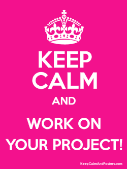

# Pd2.2_2021

The story behind `Keep Calm` posters [here](https://london.ac.uk/about-us/history-university-london/story-behind-keep-calm-and-carry)

## Table of Contents

<!-- toc -->

- [INTRODUCTION](#introduction)
- [WHAT TO DO?](#what-to-do)
  * [1. Technical Requirements](#1-technical-requirements)
  * [(2) Visual Requirements](#2-visual-requirements)
  * [(3) Accessibility](#3-accessibility)
  * [(4) Project Management](#4-project-management)
  * [(5) Video Presentation](#5-video-presentation)
  * [(6) Deployment (Optional)](#6-deployment-optional)
- [HAND OVER SPRINTS](#hand-over-sprints)
  * [SPRINT 1+2: Website repository (+ deployment) + esborrany de la presentació](#sprint-12-website-repository--deployment--esborrany-de-la-presentacio)
  * [SPRINT 2: Presentation finished](#sprint-2-presentation-finished)
  * [Video Presentations premiere](#video-presentations-premiere)

<!-- tocstop -->

## INTRODUCTION
Create a web interface using a Front Framework (Vue.js or React) and a CSS Framework (Bootstrap/Material D./Bulma/Tailwind/other) or toolset (Grid+Flexbox)

The interface will follow the `Usability`, `UX` and `Acccessibility` criteria seen during the course and apply basic `Performance enhancing` techniques.

## WHAT TO DO?

### (1) Technical Choice
- [] Choose a __CSS Framework__ (Bootstrap / Material D. / Bulma / Tailwind / Grid+Flexbox toolset / other of your choice)
- [] Choose a __Front Framework__: Vue.js (that we'll see in class) or React.js
- [] Justify why you're using this toolset

### (2) Preparation
- [ ] Create a `color palette` and chose `fonts` and `icons` for your project
- [ ] Create a simple `Wireframe` of the screens of your app using the tools seen in class (Temps a invertir aprox: 2h) 

### (3) Planification and management
- [ ] Put inside a `Gantt Diagram` the estimation of time and sequencing of tasks (you can use [Miro](https://miro.com/) and share the link on top of the README.MD file
- [] Create a private repository, share it with `classicoman2` and insert the link [in this document](https://docs.google.com/spreadsheets/d/1GU-yBlZW1Zx9zxNPLuJpAlfvohR6mnwaI39EcOSN72Y/edit)
- [ ] Use a Project Management Tool to create a `Kanban` structure (or similar) to structure the project `use cases` and `tasks`

### (4) Usability & Design
- [ ] Follow as much as possible the `Design` and `Usability/UX` criteria seen in class when creating the layout of your application

### (5) Accessibility
- [ ] Create at least one form following the `Validation and Usability` criteria and also fulfill the `Accessibility principles` seen in class
- [ ] Create at least a menu that follows the `Accessibility principles` seen in class

### (6) Video Presentation
- Create a video presentation (in ENGLISH) of maximum 5' to show the layout of your application

### (7) Deployment (Optional)
- Deploy the website using **Netlify/Heroku** or similar tools and share the link in the 

## SPRINTS :rocket:
### SPRINT 1
> :alarm_clock: Deadline: Wednesday 24/02/2021
> Val el 15% de la nota

- [ ] Punts 1, 2 i 3 dels requerimets

### SPRINT 2: Final prototype
> :alarm_clock: Deadline: Thursday 18/03/2021
